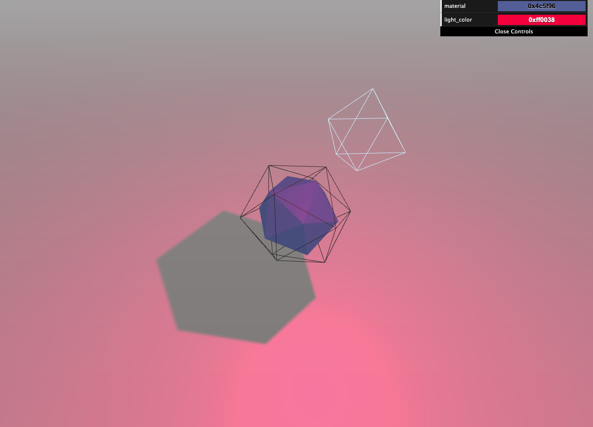

# Creative Coding I: Design & Communication

Anna Eschenbacher | anna.eschenbacher@filmuniversitaet.de | Merz Akademie

---

# Script 07: Three.js

- [Script 07: Three.js](#script-05-the-web)
  - [What is Three.js?](#What-is-Threejs-)
    - [Three.js](#Threejs)
    - [WebGL](#WebGL)
    - [Alternatives](#Alternatives)
  - [Example projects](#Example-projects)
  - [Building your first scene](#Building-your-first-scene)
    - [Setup](#Setup)
  - [Scene.js](#Scenejs)
  - [Summary](#summary)
  - [Further Tutorials](#Further-Tutorials)
  - [References](#references)

---

## What is Threejs ?

### Threejs

Three.js is an **open-source library** and **API** using WebGL. It is used to create and display animated 3D graphics in a web browser. It simplifies the creation of WebGL tools and environments. [[2]](https://github.com/mrdoob/three.js/) This means, there is a whole library of simplified functions for geometries, materials, lighting, audio, etc. Alternatively, you could write everything in WebGL, but that is a bit more complicated as you can see in the example below.

### WebGL

WebGL is a JavaScript API for rendering interactive 2D and 3D graphics. It is executed on a computer's GPU. It consists of control code written in JavaScript and shader code which is written in OpenGL ES Shading Language (GLSL ES), a language similar to C or C++. [[1]](https://developer.mozilla.org/en-US/docs/Web/API/WebGL_API)

Here is an example for WebGL code:

```js
<!doctype html>

<html>

  <body>

 	<canvas width="500" height="500"></canvas>

  <script>

    var canvas,
        gl,
        vertices,
        vertexBuffer,
        vertexShader,
        fragmentShader,
        shaderProgram;

    init();
    setupBuffers();
    createVertexShader();
    createFragmentShader();
    createShaderProgram();
    assignShadersToBuffers();
    draw();

    function init()
    {
      canvas = document.getElementsByTagName('canvas')[0];
      gl = canvas.getContext('webgl');
      vertices = [0, 1, 1, -1, -1, -1];
    }

    function setupBuffers()
    {
      vertexBuffer = gl.createBuffer();
      gl.bindBuffer(gl.ARRAY_BUFFER, vertexBuffer);
      gl.bufferData(gl.ARRAY_BUFFER, new Float32Array(vertices), gl.STATIC_DRAW);
      gl.bindBuffer(gl.ARRAY_BUFFER, null);
    }

    function createVertexShader()
    {
      var vertexShaderCode =
      'attribute vec2 coordinates;' +
      'void main(void) {' +
      ' gl_Position = vec4(coordinates, 0, 1.2);' +
      '}';

      vertexShader = gl.createShader(gl.VERTEX_SHADER);
      gl.shaderSource(vertexShader, vertexShaderCode);
      gl.compileShader(vertexShader);
    }

    function createFragmentShader()
    {
      var fragementShaderCode = 'void main(void) {' +
      'gl_FragColor = vec4(1, 0, 0, 1);' +
      '}';

      fragmentShader = gl.createShader(gl.FRAGMENT_SHADER);
      gl.shaderSource(fragmentShader, fragementShaderCode);
      gl.compileShader(fragmentShader);
    }

    function createShaderProgram()
    {
      shaderProgram = gl.createProgram();

      gl.attachShader(shaderProgram, vertexShader);
      gl.attachShader(shaderProgram, fragmentShader);
      gl.linkProgram(shaderProgram);
      gl.useProgram(shaderProgram);
    }

    function assignShadersToBuffers()
    {
      var numberOfComponentsPerVertexAttribute = 2,
          normalizeValues = false,
          numberOfBytesBetweenElements=0,
          offset=0,
          coordinates;

      gl.bindBuffer(gl.ARRAY_BUFFER, vertexBuffer);

      coordinates = gl.getAttribLocation(shaderProgram, "coordinates");

      gl.vertexAttribPointer(coordinates, numberOfComponentsPerVertexAttribute, gl.FLOAT, normalizeValues, numberOfBytesBetweenElements, offset);
      gl.enableVertexAttribArray(coordinates);
    }

    function draw()
    {
      var drawMode = gl.TRIANGLES,
          first=0,
          count=3;

      gl.clearColor(0.7, 0.7, 0.7, 1);
      gl.clear(gl.COLOR_BUFFER_BIT);
      gl.drawArrays(drawMode, first, count);
    }


  </script>

  </body>
</html>
```

This code will produce the following image: <br>

As you can see it it's quite **a lot** of code for a simple red triangle. This is where Three.js comes in to simplify the creation of 3D graphics with WebGL.

### Alternatives

There are a few alternatives to Three.js. The most popular one for 3D content might be [babylon.js](https://www.babylonjs.com/). Of course [p5.js](https://p5js.org/) is also an alternative, but mostly used for 2D graphics.

## Example projects

To get a first idea of what Three.js can do, let's have a look at some example projects:

- [cat](https://codepen.io/Yakudoo/pen/oXJYxy) <br>

- [instancing](https://threejs.org/examples/#webgl_buffergeometry_instancing) <br>

- [underwater journeys](https://www.bluemarinefoundation.com/the-sea-we-breathe/) <br>

- [HELIOS](http://unseen-music.com/yume/)
  <br>

- [POLA](https://www.pola.co.jp/wecaremore/mothersday/)
  <br>

- [Swiss army man](https://swissarmyman.com/)
  <br>

- [NASA voyager's grand tour](https://eyes.nasa.gov/apps/solar-system/#/story/voyager_grand_tour)
  <br>

- [Design the next iPhone](https://neal.fun/design-the-next-iphone/)
  <br>

- [Design the next iPhone](https://fungui.resn.co.nz/)
  <br>

- [VR Dust](https://vrdust.org.uk/)
  <br>

- [noise blob](https://codepen.io/vcomics/pen/ZwNgvX?editors=1010)

- [deprogrammed](http://www.deprogrammed.org/)

- [Thump Thump](http://www.larsberg.net/#/thumpThump)

- [storytelling: oat the goat](http://www.oatthegoat.co.nz/)

- [real time short film](http://www.dilladimension.com/)

- [band website](https://www.aquarium.ru/en)

### More examples can be found here:

- [three.js examples](https://threejs.org/examples/#webgl_animation_keyframes)
- [featured projects on the three.js](https://threejs.org/)
- [awarded Three.js projects](https://www.awwwards.com/websites/three-js/?ads=1&page=1)

## Building your first scene

So let's get started with our first Three.js project.

### Setup

We will use a very simple folder structure. We have a threejs folder with our style.css file in the 'css' folder. The necessary libraries ([three.min.js](https://raw.githubusercontent.com/mrdoob/three.js/dev/build/three.min.js), [dat.gui.min.js](https://raw.githubusercontent.com/dataarts/dat.gui/master/build/dat.gui.min.js), [OrbitControls.js](https://raw.githubusercontent.com/mrdoob/three.js/dev/examples/js/controls/OrbitControls.js)) are in the lib folder, so we don't have to save them in every single project. Our project folder is named 'basic_scene'. In here, we have our index.html file and we have the scene.js file, where we will write our three.js project. I uploaded already prepared the file structure and added everything to it so we can focus on our scene.js file.

```js
- threejs
    - lib
        - three.min.js
        - OrbitControls.js
        - dat.gui.min.js
    - css
        - style.css
    - proj1
        - index.html
        - scene.js
    - proj2
        - index.html
        - scene.js
    - ...
```

Our css file:

```css
html,
body {
  margin: 0;
  padding: 0;
}
```

We don't use css much, but we want to make sure, that our scene fills the entire browser window.

Our html file:

```html
<!DOCTYPE html>
<html>
  <head>
    <meta charset="UTF-8" />
    <title>Three js workshop</title>

    <link rel="stylesheet" type="text/css" href="../css/style.css" />
    <link rel="shortcut icon" type="image/x-icon" href="../favicon.ico" />

    <!-- Three.js -->
    <script src="../lib/three.min.js"></script>

    <!-- Orbit Controls -->
    <script src="../lib/OrbitControls.js"></script>

    <!-- dat.GUI -->
    <script src="../lib/dat.gui.min.js"></script>
  </head>

  <body>
    <canvas id="c"></canvas>
    <script src="scene.js"></script>
  </body>
</html>
```

In our HTML file we import the necessary libraries either locally or from an URL. Generally it makes sense to download the script, in case changes are made to the online version. Otherwise this might cause errors in your project. I would recommend using the same library files as I uploaded in the folder structure to avoid errors with updated files. We are using some minified libraries, they are contentwise the same just smaller in file size.

Inside the <body> tag, we call our `scene.js` file, where we will write our Three.js code.

To run this project we will use the same extensions as you did before - [live server](https://marketplace.visualstudio.com/items?itemName=ritwickdey.LiveServer) for VSCode. You should open your 'threejs' folder in VSCode, so the live server can access the libraries (not just our project folder).

### Scenejs

Now the fun part begins - let's get started with our `scene.js` file.
A basic Three.js project consists of these elements and we will go through them one by one: <br> [[3]](https://threejs.org/manual/resources/images/threejs-structure.svg)

To actually be able to display anything with three.js, we need three things: scene, camera and renderer, so that we (you guessed it) can render the scene with a camera. I already added some tags in the scene.js file, so you know where to copy the code to.

```js
// SCENE
const scene = new THREE.Scene();
const bgColor = 0xffc0cb; //or hex code "#ffc0cb"
scene.background = new THREE.Color(0xffc0cb);

// CAMERA
const fov = 75;
const aspect = window.innerWidth / window.innerHeight;
const near = 0.1;
const far = 100;
const camera = new THREE.PerspectiveCamera(fov, aspect, near, far);
camera.position.z = 10;

// RENDERER
const canvas = document.querySelector("#c");
const renderer = new THREE.WebGLRenderer({ canvas, antialias: true });
renderer.setSize(window.innerWidth, window.innerHeight);
renderer.shadowMap.enabled = true;
renderer.shadowMap.type = THREE.PCFSoftShadowMap;

window.addEventListener("resize", () => {
  renderer.setSize(window.innerWidth, window.innerHeight);
  camera.aspect = window.innerWidth / window.innerHeight;
  camera.updateProjectionMatrix();
});
```

#### Scene

Three.js uses the concept of a [scene](https://threejs.org/manual/#en/scenegraph) to define an area where you can place things like geometry, lights, cameras, and so on. Later on, we will add objects into our scene, so they are visible to the camera and renderer.

#### Camera

There are a few different cameras in Three.js. We will use a [PerspectiveCamera](https://threejs.org/manual/#en/cameras) since its projection mode is designed to mimic the way the human eye sees. **PerspectiveCamera( fov : Number, aspect : Number, near : Number, far : Number )**

The first attribute is the **field of view**. FOV is the extent of the scene that is seen on the display at any given moment. The value is in degrees.


	
[[4]](https://kintronics.com/wp-content/uploads/2022/08/FOV.jpg)

The second one is the **aspect ratio**. You almost always want to use the width of the element divided by the height, otherwise you'll get a distorted image. The next two attributes are the **near and far clipping plane**. What that means, is that objects further away from the camera than the value of **far** won't be rendered. Same applies to objects closer than the **near** value. This is mainly used for better perfomance. By defining these attributes, we constrain the rendered area to space inside of the purple box in this image:


[[5]](https://pbs.twimg.com/media/Di2Z3InU8AAd3bm.jpg)

#### Renderer

Next up is the **renderer**. We will use the WebGLRenderer. Three.js comes with a few others, often used as fallbacks for users with older browsers or for those who don't have WebGL support for some reason. We also need to **set the size** at which we want it to render our app. It is best to use the width and height of the area we want to fill with our app - in this case, the width and height of the browser window. We already added some details about shadows here. That is not relevant at the moment, but we will get back to this later.

As a last step, we add an EventListener for the browser window size. This ensures a responsive Three.js scene, when the size changes.

Now we have a **scene**, a **camera**, and **renderer**. Let's put something into our scene.

#### Coordinate System

Before we add any meshes, we will take a quick look at the coordinate system. Three.js uses the same coordinate system as p5.js, where the default orientation of the camera is looking down the -Z axis.

 [[6]](https://threejs.org/manual/resources/scene-down.svg)

Often times the first object is a cube, but let's go with an [icosahedron](https://threejs.org/docs/#api/en/geometries/IcosahedronGeometry), which is a much fancier shape. If you prefer a cube you can exchange the first line with `const geometry = new THREE.BoxGeometry();` instead.

```js
// GEOMETRY
// ICOSAHEDRON
const radius = 1.5;
const detail = 0;
const icosaGeometry = new THREE.IcosahedronGeometry(radius, detail);
const icosaMaterial = new THREE.MeshPhongMaterial({ color: 0x5f769f });
const mesh = new THREE.Mesh(icosaGeometry, icosaMaterial);
mesh.castShadow = true;
// add the mesh to the scene
scene.add(mesh);
```

#### Geometry

To create a icosahedron, we need a **THREE.IcosahedronGeometry(radius, detail)**. This is an object that contains all the points (vertices) and fill (faces) of the icosahedron. Three.js offers a few basic and some more complex geometric shapes.

#### Material

We will also need a **material** to color it. Three.js comes with [several materials](https://threejs.org/manual/#en/materials), but we'll use the MeshPhongMaterial for now. All materials can be filled with certain attributes to change the look. This can be color, roughness, as well as a texture. Here are all attributes listed for a [MeshPhongMaterial](https://threejs.org/docs/#api/en/materials/MeshPhongMaterial).

#### Mesh

The third thing we need is a [**mesh**](https://threejs.org/docs/#api/en/objects/Mesh). A mesh is an object that takes a **geometry**, and applies a **material** to it. Afterwards we can insert into our **scene** with scene.add().


By default, when we call scene.add(), the object we add will be added to the coordinates (0,0,0). This is why we moved the camera back a bit earlier.

#### Lighting

To be able to see anything we still need some light. There are a few different [lights](https://threejs.org/examples/?q=light#webgl_lights_hemisphere) like ambient light, directional light, point light, spot light. First, will use an ambient light to illuminate the whole scene.

```js
// LIGHTING
// AMBIENT
const lightColor = 0xffffff;
const lightIntensity = 0.8;
const ambientLight = new THREE.AmbientLight(lightColor, lightIntensity);
// add the ambient light to the scene
scene.add(ambientLight);
```

#### Render/Animate loop

Now we will add an animate or render loop similar to the draw() loop in p5.js. This will create a loop that causes the renderer to draw the scene every time the screen is refreshed (typically around 60 times per second).

```js
// ANIMATE LOOP
function animate() {
  renderer.render(scene, camera);
  requestAnimationFrame(animate);
}
requestAnimationFrame(animate);
```

Let's have a look at our scene. When you start the live-server you still have to click on workshop to open our index file.


Yeahi :) we have a icosahedron, but we can't really move around it. Let's add OrbitControls - a library that enables us to move around the space.

Add this above the //GEOMETRY tag:

```js
// CONTROLS FOR NAVIGATION
const controls = new THREE.OrbitControls(camera, renderer.domElement);
```

and add controls.update(); into our animate loop:

```js
// ANIMATE LOOP
function animate() {
  controls.update();
  renderer.render(scene, camera);
  requestAnimationFrame(animate);
}
requestAnimationFrame(animate);
```

Now try dragging the mouse across your scene and zooming in and out by scrolling. We still can't really make out the shape of the mesh. Let's add a point light light that casts shadows below the ambient light.

```js
// POINTLIGHT
const lightColorPoint = 0xfc60f0;
const lightIntensityPoint = 0.8;
const pointLight = new THREE.PointLight(lightColorPoint, lightIntensityPoint);
pointLight.position.set(0, 4, 2);

// shadow settings
pointLight.castShadow = true;
pointLight.shadow.mapSize.width = 1024;
pointLight.shadow.mapSize.height = 1024;
pointLight.shadow.camera.near = 1;
pointLight.shadow.camera.far = 600;
pointLight.shadow.radius = 10;

// add the point light to the scene
scene.add(pointLight);

const sphereSize = 1;
const pointLightHelper = new THREE.PointLightHelper(pointLight, sphereSize);
// add the point light helper to the scene
scene.add(pointLightHelper);
```

The **pointLightHelper** is a frame around the light so we can see where it is positioned in our space. Try zooming out a bit too see it. You can also leave it out, but sometimes it is helpful when designing a scene.

To make our scene a bit more exciting, we will add some animation. One easy way to do this is incrementing the rotation value of the mesh.

Add the following right below the requestAnimationFrame(animate) function:

```js
// ANIMATE LOOP
function animate() {
  mesh.rotation.x += 0.004;
  mesh.rotation.y += 0.007;

  controls.update();
  renderer.render(scene, camera);
  requestAnimationFrame(animate);
}
requestAnimationFrame(animate);
```

Congratulations :) You just created your first Three.js application!

To make it prettier we can add a few more things. Let's start with a floor plane below the mesh. Paste this below the icosahedron.

```js
// FLOOR
const width = 300;
const height = 300;
const planeGeometry = new THREE.PlaneGeometry(width, height);
const planeMaterial = new THREE.MeshPhongMaterial({ color: bgColor, depthWrite: false });
const planeMesh = new THREE.Mesh(planeGeometry, planeMaterial);
// rotate and translate position to imitate a floor
planeMesh.rotation.x = -Math.PI / 2;
planeMesh.position.y = -10;
planeMesh.receiveShadow = true;
scene.add(planeMesh);
```

Nice! Now we have a floor plane and the point light is casting a shadow onto it. That is why we had to add define which mesh casts or receives shadows earlier. Additionally, we allowed shadows in the beginning with `renderer.shadowMap.enabled = true;`.

So at the moment we can see the edge of our plane. Sometimes you might want to see it, but let's go with a soft transition to the background color to bring the focus to our object. We can do this by adding [fog](https://threejs.org/docs/index.html#api/en/scenes/FogExp2). Add the following line to our //SCENE tag:

```js
// SCENE
const scene = new THREE.Scene();
const bgColor = 0xffc0cb;
scene.background = new THREE.Color(0xffc0cb);
scene.fog = new THREE.FogExp2(scene.background, 0.02); // add this
```

You can set the color and density of the fog with `THREE.FogExp2(color, denisity)`.

Your scene should look something like this:


As a last step we want to add some interactivity with a graphical user interface [GUI](https://github.com/dataarts/dat.gui). Insert this above the animation loop:

```js
// GUI
const gui = new dat.GUI({ width: 300 });
gui.open();

// get the default value
const parameters = {
  material: icosaMaterial.color.getHex(),
};

gui.addColor(parameters, "material").onChange(function (val) {
  icosaMaterial.color.setHex(val);
});
```

Try changing the color of the mesh with the GUI in the upper right corner. You could do the same thing with our point light by adding another gui parameter. Additionally, we can add a slider to change the x value of our mesh:

```js
// GUI
const gui = new dat.GUI({ width: 300 });
gui.open();

// get the default value
const parameters = {
  material: icosaMaterial.color.getHex(),
  light_color: pointLight.color.getHex(),
  positionX: mesh.position.x,
};

gui.addColor(parameters, "material").onChange(function (val) {
  icosaMaterial.color.setHex(val);
});
gui.addColor(parameters, "light_color").onChange(function (val) {
  pointLight.color.setHex(val);
});
gui.add(parameters, "positionX", -4.0, 4.0).onChange(function (val) {
  mesh.position.x = val;
});
```

We can also add a second mesh. This time the material is set to wireframe, so we will only see the connected edges.

```js
//ICOSAHEDRON 2
const radiusTwo = 2;
const detailTwo = 0;
const icosaGeometry_2 = new THREE.IcosahedronGeometry(radiusTwo, detailTwo); //radius, detail
const material_2 = new THREE.MeshPhongMaterial({ color: 0x5f769f, wireframe: true });
const icosa_2 = new THREE.Mesh(icosaGeometry_2, material_2);
icosa_2.castShadow = true;
scene.add(icosa_2);
```

and animate it in the animate loop:

```js
// ANIMATE LOOP
function animate() {
  mesh.rotation.x += 0.004;
  mesh.rotation.y += 0.007;

  icosa_2.rotation.x += 0.008;
  icosa_2.rotation.z += 0.005;

  controls.update();
  renderer.render(scene, camera);
  requestAnimationFrame(animate);
}
requestAnimationFrame(animate);
```



That's it for now! I added a few more features to the gui in the advanced_scene folder. Malte also added more examples with OBJ imports, Raycaster for clicking on objects and an HDR scene.
Now it's your turn to expand this scene or create your own :) 🥳✨💥

It's always a good starting point to go through the [documentation](https://threejs.org/docs/index.html#manual/en/introduction/Creating-a-scene) of Three.js to find some parameters you can change and add.

Feel free to contact me if you have any questions: anna.eschenbacher@filmuniversitaet.de

---

## Summary

- Three.js is a JavaScript library and API used to create and display 3D computer graphics with WebGL
- The main components to run a Three.js project are: scene, camera, renderer, light, and 3D mesh (geometry + material)

---

## Further Tutorials

- https://threejs.org/
- https://discoverthreejs.com/
- https://threejsfundamentals.org/
- there are some cool tutorials on [medium.com](https://medium.com/@mag_ops/music-visualiser-with-three-js-web-audio-api-b30175e7b5ba)

---

## References

[[1] WebGL definition](https://developer.mozilla.org/en-US/docs/Web/API/WebGL_API) [[2] Github Three.js](https://github.com/mrdoob/three.js/)
[[3] Scene Graph](https://miro.medium.com/max/701/1*Bkk14XZa94WTue7F7DrhCA.png) [[4] FOV Image](https://kintronics.com/wp-content/uploads/2022/08/FOV.jpg)
[[5] Clipping Plane](https://pbs.twimg.com/media/Di2Z3InU8AAd3bm.jpg)
[[6] Coordinate System](https://threejs.org/manual/resources/scene-down.svg)

---

The End

💻 💫🔺
